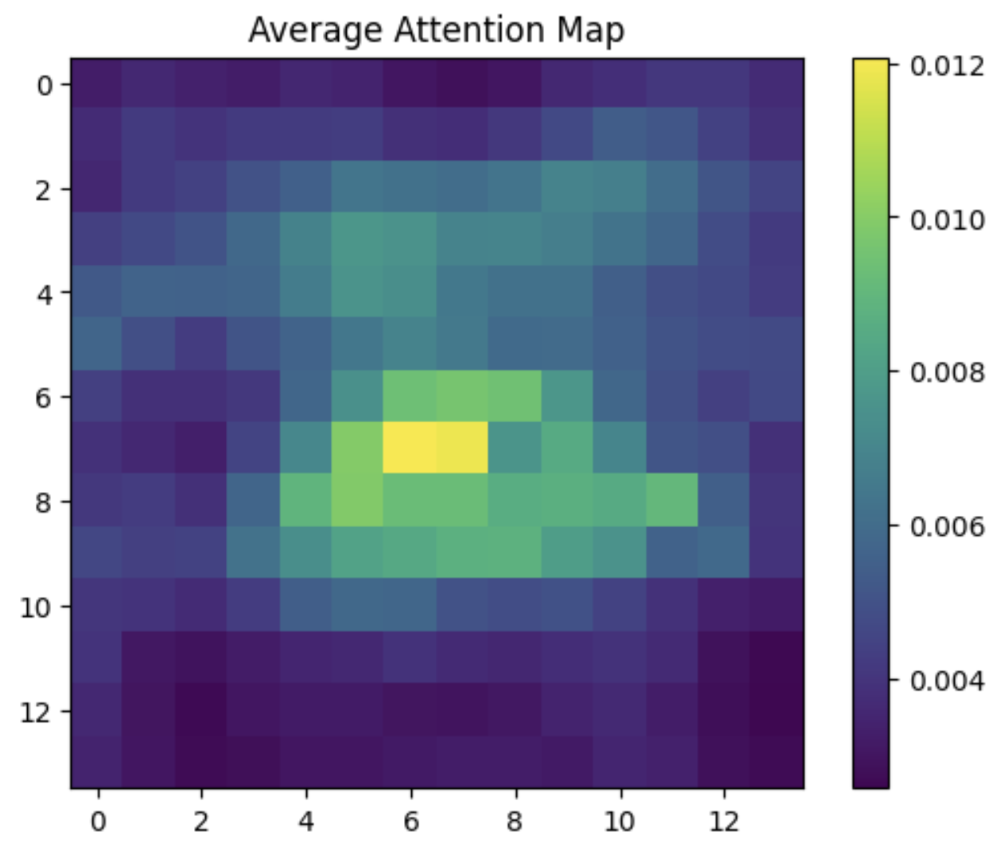

# Blink Detector

Case study for using AI for blink detection.

Training over 2 epochs saw a 90% success rate.

## Files

`blink_detector.ipynb` Shows experimentation using pretrained ViT model `google/vit-base-patch16-224-in21k`.

`blink_detector.py` Model tuning file

`live_blink_detection.py` Live inference model

`model_new.pth` Revised model after pruning dataset

/old_data: https://www.kaggle.com/datasets/kayvanshah/eye-dataset?resource=download&select=Eye+dataset

/data: Pruned open sample size to 3828 randomly to match closed sample size

## Outputs

### Demo Gif

### Attention Map
